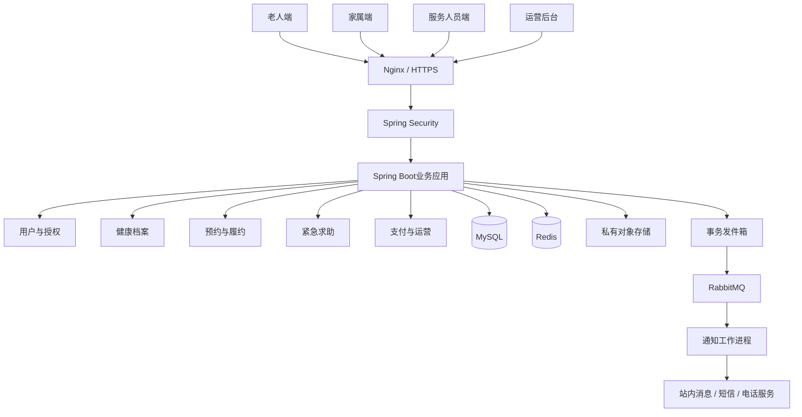

# 业务系统设计

状态：规划。本文定义后续业务开发的模块、数据模型、接口和验收要求。当前已实现接口见[基础框架接口](FRAMEWORK_API.md)，工程约束见[开发规范](DEVELOPMENT.md)。

## 1. 业务范围

### 1.1 业务目标

建设连接老年人、家属、服务人员和社区运营机构的一站式养老服务平台，实现健康档案、上门预约、紧急求助、家属远程查看和运营管理，形成“申请—调度—履约—反馈—改进”的闭环。

平台提供健康信息管理和服务协调，不进行自动诊断，不替代专业急救。老人保有个人信息控制权，家属身份不自动产生健康数据访问权限。

### 1.2 一期范围

| 纳入一期 | 后续扩展 |
|---|---|
| 老人端、家属端、服务人员端、管理后台 | 原生App |
| 手工录入健康记录和附件 | 智能手环、实体呼叫器 |
| 服务预约、人工派单、履约 | 智能调度 |
| 微信支付和退款 | 多渠道支付 |
| 求助通知、人工接警、电话兜底 | 经正式合作的急救系统对接 |
| 分项授权查看、代预约 | 更多机构数据互通 |

一期不包含家庭视频监控、持续位置跟踪和自动续费。医疗护理项目由具备相应资质的机构和人员提供。

## 2. 技术栈与架构

### 2.1 目标技术栈

| 层级 | 技术 | 用途 |
|---|---|---|
| 管理后台 | Vue 3、TypeScript、Element Plus、Vite | 社区和企业运营 |
| 移动端 | uni-app、Vue 3、TypeScript | 微信小程序 |
| 前端状态 | Pinia | 登录状态、页面和业务状态 |
| 后端 | Java、Spring Boot | 业务接口 |
| 认证授权 | Spring Security | 身份认证、权限控制 |
| 数据访问 | MyBatis-Plus、MyBatis XML | 常规持久化、复杂查询 |
| 数据库 | MySQL | 核心业务数据 |
| 缓存 | Redis | 会话、验证码、限流和短期缓存 |
| 消息 | RabbitMQ | 通知、异步任务和重试 |
| 附件 | 私有云对象存储 | 健康附件、必要履约材料 |
| 接口文档 | OpenAPI | 接口契约和联调 |
| 部署 | Linux、Nginx、Docker | 运行和发布 |

依赖版本以各工程配置和锁文件为准，见[依赖与参考资料](REFERENCES.md)。短信、电话及对象存储通过适配层接入，供应商凭据使用外部配置管理。

### 2.2 整体架构



后端按业务模块组织，初期不拆分微服务。求助通知使用独立队列及消费者，避免普通消息积压影响处理。数据库是订单、授权和求助状态的最终依据，Redis不承担唯一持久化职责。

## 3. 用户角色与权限

| 角色 | 允许操作 | 数据边界 |
|---|---|---|
| 老人 | 管理档案、预约、求助、授权 | 本人数据 |
| 家属 | 查看、代预约、接收提醒 | 老人授予的具体范围 |
| 服务人员 | 接单、履约、异常上报 | 当前受派订单及必要资料 |
| 社区运营 | 排班、派单、回访、投诉处理 | 所属社区 |
| 值守人员 | 接警、回拨、升级、结案 | 求助处理所需资料 |
| 平台管理员 | 账号和系统配置 | 不默认开放完整健康记录 |
| 审计人员 | 查看访问与操作记录 | 审计数据 |

权限判断同时检查身份、角色、社区范围、数据归属、授权有效期和当前业务关系。禁止仅按客户端传入的老人编号或社区编号查询数据。

## 4. 前端详细设计

### 4.1 工程结构

```text
frontend/
├── admin-web/
│   └── src/
│       ├── api/
│       ├── views/
│       ├── components/
│       ├── router/
│       ├── stores/
│       └── styles/
└── mobile/
    └── src/
        ├── api/
        ├── pages/
        ├── components/
        ├── stores/
        └── styles/
```

移动端共用请求封装、登录状态和基础组件，按角色呈现页面。服务人员由后台审核开通，用户不能通过前端切换身份取得权限。

### 4.2 页面与功能

| 端 | 页面 | 内容及操作 |
|---|---|---|
| 老人 | 首页 | 常用功能、今日安排、固定求助入口 |
| 老人 | 我的健康 | 最近记录、测量时间、单位、来源、历史趋势 |
| 老人 | 预约服务 | 服务列表、详情、时段、地址、核对下单 |
| 老人 | 我的订单 | 人员、金额、状态、取消、验收、评价 |
| 老人 | 我的家人 | 关联申请、权限范围、到期时间、撤销 |
| 家属 | 老人概览 | 已关联老人、授权信息、更新时间 |
| 家属 | 代预约 | 选择老人和服务、预约、代支付 |
| 服务人员 | 任务列表 | 待接单、今日任务、异常任务 |
| 服务人员 | 任务详情 | 必要地址和注意事项、接单、到达、完成 |
| 后台 | 工作台 | 待派单、未接警、投诉和业务摘要 |
| 后台 | 业务管理 | 老人、服务、人员、排班、订单 |
| 后台 | 求助工作台 | 接警、联络、升级、时间线、结案 |
| 后台 | 安全管理 | 账号权限、审计、隐私申请 |

### 4.3 适老化规范

以下数值为本项目设计目标，按实际终端换算验证，不把CSS像素直接等同于原生端dp或pt。

| 项目 | 要求 |
|---|---|
| 字体 | 正文默认20px，辅助文字不低于18px，提供特大字号 |
| 缩放 | 200%缩放时核心内容和按钮不丢失、不遮挡 |
| 按钮 | 常用按钮高度至少56px，点击区域至少48×48 CSS px |
| 对比度 | 普通文字与背景对比度目标不低于4.5:1 |
| 导航 | 底部固定“首页、预约、健康、我的” |
| 表达 | 简短中文，图标带文字，不只依靠颜色表达状态 |
| 输入 | 优先选择和预填，减少手工输入 |
| 反馈 | 明确处理中、成功、失败及下一步 |
| 辅助 | 支持读屏和语音辅助，不依赖复杂手势 |
| 隐私 | 默认不外放健康详情，通知不展示疾病信息 |

参考：[工信部适老化及无障碍改造相关要求](https://www.miit.gov.cn/jgsj/xgj/gzdt/art/2021/art_eddf498ded1b44829644bf20d28c9f6f.html)。

### 4.4 首页线框

```text
┌──────────────────────────┐
│ 社区养老       字体大小 帮助 │
│ 您好，张阿姨               │
├──────────────────────────┤
│ [预约上门服务] [我的健康]   │
│ [联系社区人员] [我的家人]   │
├──────────────────────────┤
│ 今天的安排                 │
│ 下午2点：上门助洁          │
│ 已安排工作人员 [查看详情]  │
├──────────────────────────┤
│       [紧急求助]           │
│       [拨打120]            │
├──────────────────────────┤
│ 首页   预约   健康   我的   │
└──────────────────────────┘
```

求助入口固定可见，适配安全区域，不遮挡其他操作。老人端不直接复用后台的密集表格和小尺寸控件。

### 4.5 关键交互和异常

- 预约：选择服务→选择时段及地址→核对总价和规则→提交；客户端禁用重复点击，后端执行幂等控制。
- 健康：显示测量时间、单位和来源；缺失或过期数据不能显示“健康正常”。
- 授权：关系关联与健康授权分开确认；可逐项授权和撤销。
- 求助：首次点击立即发送，不设置复杂前置表单；发送失败明确告知并突出电话入口。
- 登录失效：普通业务重新登录，紧急电话入口保持可用。
- 请求失败：提供重试，不显示成功状态；权限失效时清理相关页面内容。

前端不持久化健康详情，不在URL中传递令牌；注销时清理缓存。所有输入安全渲染，异常上报屏蔽敏感字段。

## 5. 后端详细设计

### 5.1 模块结构

```text
backend/
├── identity       认证和账号
├── elder          老人档案
├── consent        亲属关系和授权
├── health         健康记录
├── catalog        服务目录
├── appointment    预约、容量和派单
├── fulfillment    履约和异常
├── emergency      求助和接警
├── payment        支付、退款和对账
├── notification   通知和重试
├── operation      投诉、回访和统计
└── audit          审计和隐私申请
```

模块内部按Controller、Service、Mapper及数据对象划分。事务边界放在Service层，Controller不直接操作数据库。对外响应使用专用DTO，不直接序列化数据库实体。

### 5.2 认证与会话

- 小程序提交微信登录凭证，由服务端向微信换取身份，不信任客户端自报的用户标识。
- 小程序采用短期访问令牌和可撤销的刷新会话；刷新令牌轮换并处理重复使用。
- 管理后台采用服务端会话及Secure、HttpOnly Cookie，配置适当SameSite策略和CSRF防护。
- 管理员启用多因素认证；验证码限制频率、时效和尝试次数。
- 注销、账号停用和凭证重置使相关会话失效。

### 5.3 健康档案与家属授权

一期支持血压、血糖、心率、过敏史及备注。数据保存测量时间、录入人和来源，自填数据不能标记为医疗机构确认。数值校验用于发现输入错误，不直接输出诊断。

授权范围包括查看订单、代预约、查看健康摘要、查看健康详情及接收求助通知。关系核验与权限授予分别记录；每项授权包含期限和撤销时间。撤销后下一次访问立即拒绝，并清理权限缓存。代办或监护需核验实际依据。

## 6. 数据库设计

### 6.1 通用规则

- 主键使用BIGINT，对外以字符串返回，避免前端精度问题。
- 金额使用整数分，禁止浮点数结算。
- 时间统一按UTC保存，接口使用带时区的ISO 8601格式。
- 常规业务表包含created_at、updated_at及需要时使用的version。
- 逻辑删除不替代个人信息到期清理。
- 密钥独立管理，不保存在业务表或源码中。

### 6.2 规划数据模型

| 表名 | 关键字段 | 约束或索引 |
|---|---|---|
| user_account | id、身份标识、phone_cipher、status | 登录身份唯一 |
| elder_profile | id、user_id、community_id、name_cipher、address_cipher | 社区和用户索引 |
| family_relation | elder_id、family_user_id、status | 老人与家属组合唯一 |
| consent_grant | elder_id、grantee_id、scope、expires_at、revoked_at、version | 授权对象和范围索引 |
| health_record | elder_id、type、value_cipher、unit、measured_at、source | 老人和测量时间索引 |
| service_item | name、price_fen、duration、qualification、status | 区域和上下架状态索引 |
| service_slot | resource_id、start_at、end_at、capacity、reserved、version | 资源和时段唯一约束 |
| service_order | elder_id、creator_id、slot_id、amount_fen、status、snapshot | 老人、社区、状态和时间索引 |
| service_assignment | order_id、staff_id、status | 订单及人员索引 |
| fulfillment_record | order_id、started_at、completed_at、summary | 订单索引 |
| emergency_event | elder_id、status、location_source、accepted_by | 状态和创建时间索引 |
| emergency_action | event_id、actor_id、action、result、created_at | 事件和时间索引 |
| payment_transaction | order_id、channel_no、amount_fen、status | 渠道流水唯一 |
| refund_transaction | payment_id、refund_no、amount_fen、status | 退款请求唯一 |
| notification_task | event_id、recipient_id、channel、status、retry_count | 事件、接收者和渠道去重 |
| outbox_event | business_id、type、payload、status | 状态和创建时间索引 |
| audit_log | actor_id、target_id、action、result、trace_id | 操作者、对象和时间索引 |
| privacy_request | applicant_id、type、status、processed_at | 申请人和状态索引 |

健康字段根据实际检索需求加密，解密后仅输出获准字段。健康附件需经对象级鉴权，不能凭文件地址绕过权限。

## 7. 接口契约

### 7.1 通用约定

统一前缀为`/api/v1`。普通响应如下，支付渠道回调遵循渠道自身协议。

```json
{
  "code": "OK",
  "message": "操作成功",
  "data": {},
  "traceId": "request-trace-id"
}
```

分页使用page和pageSize，页码从1开始，默认20条，最大100条。分页响应包含items、page、pageSize、total。

| HTTP状态 | 含义 |
|---|---|
| 400 | 参数错误 |
| 401 | 登录失效 |
| 403 | 无权限 |
| 404 | 资源不存在 |
| 409 | 状态冲突或容量不足 |
| 429 | 请求过于频繁 |
| 500 | 系统异常 |

### 7.2 规划业务接口

| 方法 | 路径 | 功能及权限 |
|---|---|---|
| POST | /auth/wechat/login | 小程序登录，限流 |
| POST | /auth/logout | 注销当前会话 |
| GET | /elders/{id} | 本人或获准人员查询档案 |
| PATCH | /elders/{id} | 获准人员更新档案 |
| GET | /elders/{id}/health-records | 健康授权范围内查询 |
| POST | /elders/{id}/health-records | 获准录入者新增健康记录 |
| POST | /elders/{id}/grants | 核验授权主体后授予权限 |
| DELETE | /elders/{id}/grants/{grantId} | 撤销授权 |
| GET | /services | 服务目录 |
| GET | /services/{id}/slots | 可用时段 |
| POST | /orders | 本人或有代预约权限者下单 |
| GET | /orders/{id} | 数据范围内查询订单 |
| POST | /orders/{id}/cancellation | 按状态申请取消 |
| POST | /orders/{id}/assignments | 所属社区调度派单 |
| POST | /orders/{id}/acceptance | 当前受派人员接单 |
| POST | /orders/{id}/start | 当前服务人员开始履约 |
| POST | /orders/{id}/completion | 提交履约结果 |
| POST | /orders/{id}/confirmation | 老人或获准代办者验收 |
| POST | /emergencies | 快速创建求助 |
| GET | /emergencies/{id} | 本人、获准家属或处理人员查询 |
| POST | /emergencies/{id}/acknowledgements | 值守人员接警 |
| POST | /emergencies/{id}/actions | 记录联络和处理动作 |
| POST | /orders/{id}/payments | 发起微信支付 |
| POST | /orders/{id}/refunds | 按订单规则申请退款 |
| POST | /privacy/requests | 提交隐私权利申请 |

### 7.3 预约示例

请求头携带Idempotency-Key，相同用户重复提交同一键和相同内容返回原订单；同一键不同内容返回冲突。

```json
{
  "elderId": "10001",
  "serviceId": "20001",
  "slotId": "30001",
  "addressId": "40001",
  "remark": "请到达后敲门"
}
```

```json
{
  "code": "OK",
  "message": "预约已创建",
  "data": {
    "orderId": "50001",
    "status": "PENDING_PAYMENT",
    "amountFen": 8000
  },
  "traceId": "request-trace-id"
}
```

金额由服务端计算，同时校验老人授权、地址归属、服务区域和时段容量。

### 7.4 求助示例

```json
{
  "clientRequestId": "unique-client-request-id",
  "elderId": "10001",
  "location": null,
  "source": "MINI_PROGRAM"
}
```

成功响应包含eventId、status和createdAt；status初始为CREATED，仅代表已持久化到平台，不代表人工接警。坐标为可选项，存在时须附带采集时间及来源。网络失败时保留原clientRequestId重试，避免重复事件。

## 8. 业务流程与一致性

### 8.1 订单状态

```text
PENDING_PAYMENT 待支付
    → PENDING_ASSIGNMENT 待派单
    → ASSIGNED 已派单
    → ACCEPTED 已接单
    → IN_SERVICE 服务中
    → PENDING_CONFIRMATION 待确认
    → COMPLETED 已完成
```

免费订单直接进入待派单。取消进入CANCELLED，服务开始后的争议通过独立工单处理。支付和退款状态独立维护，不以支付成功代替履约完成。

- 数据库事务和条件更新控制容量，禁止超额预约。
- 未支付订单按配置超时关闭并释放容量。
- 改期原子完成新容量占用和旧容量释放。
- 已成交订单保留服务和价格快照。
- 人员拒单回到待派单并留痕，资质及排班冲突由服务端检查。

### 8.2 求助状态

```text
CREATED 已创建 → ACKNOWLEDGED 已接警 → PROCESSING 处理中 → CLOSED 已结束
```

事件和通知任务在同一事务中保存，通过发件箱可靠投递。接警使用原子更新避免重复领取。初步规划30秒未接警提醒备用坐席、60秒升级负责人，正式阈值由值守能力及演练确认，不承诺急救到达时间。

定位拒绝时使用确认过的地址并标明来源。误触取消保留动作记录，已接警事件须由人工核实结束。消息送达回执不等于人工接警；数据库或网络失败时明确提示并保留电话兜底。

### 8.3 支付与异步任务

支付回调核验签名、订单、金额和渠道流水；重复或乱序通知不能重复改变资金结果。退款以独立编号执行，校验累计退款金额不超过可退金额。每日对账处理漏通知。

消息按事件编号及接收对象去重，执行有界重试，最终失败进入人工异常队列。外部通知不包含疾病名称和完整地址。

## 9. 数据安全与合规

### 9.1 法规与原则

结合实际处理活动落实合法处理依据、告知、敏感信息保护及用户权利。健康和行踪信息按敏感个人信息管理。参考：[《个人信息保护法》](https://www.cac.gov.cn/2021-08/20/c_1631050028355286.htm?eqid=c1b27c46000007a10000000664659814)。

- 基于同意处理健康信息时设置单独同意，家属共享独立确认。
- 不强制收集无必要的身份证号、人脸和持续定位。
- 留存告知版本、用途、范围、时间及撤销记录。
- 提供查阅、复制、更正、删除、撤销及注销入口，也支持人工渠道。
- 适用场景上线前开展个人信息保护影响评估。
- 紧急访问仅限生命健康保护所必需范围，记录依据并事后复核。

### 9.2 安全控制

| 领域 | 措施 |
|---|---|
| 传输 | HTTPS，禁止明文传输敏感数据 |
| 存储 | 敏感字段、对象及备份加密 |
| 密钥 | 独立管理、环境隔离、轮换 |
| 权限 | 角色、社区、对象、授权和业务关系联合校验 |
| 日志 | 排除验证码、令牌和健康正文 |
| 文件 | 私有存储、鉴权、短期签名链接、类型与恶意文件检查 |
| 导出 | 默认限制批量导出，必要时审批、水印、限时下载 |
| 测试 | 使用合成数据，不复制生产健康档案 |
| 前端 | 不持久化健康详情，注销清理数据 |

按实际系统开展网络安全等级保护相关工作，不直接宣称已满足某等级。参考：[《网络数据安全管理条例》](https://www.cac.gov.cn/2024-09/30/c_1729384452307680.htm)。

### 9.3 保存、删除和供应商

上线前建立分类保存期限表，明确目的、适用义务、期限及清理方式，不统一永久保存。法定需留存的信息限制用途；删除覆盖主库、附件及相关受托方，备份恢复时重放删除记录。

一期采用境内部署，供应商合同约定用途限制、分包、事件通报及终止删除；新增SDK和跨境传输需事先评估。撤销授权阻止后续访问，但不能保证收回已合法接收的副本，因此限制导出并清晰告知。

定期开展个人信息保护合规审计并跟踪整改。参考：[《个人信息保护合规审计管理办法》](https://www.cac.gov.cn/2025-02/14/c_1741233507681519.htm)。

### 9.4 事件处置

建立发现、分级、止损、证据保全、影响评估、依法报告通知、恢复和复盘流程。重点场景包括健康数据泄露、越权访问、账户接管及求助不可用。内部响应目标不能替代法定报告通知要求。

## 10. 部署与运营交接

### 10.1 部署

- 开发、测试和生产隔离，分别使用账号和密钥。
- 数据库、Redis和RabbitMQ不直接开放公网。
- 应用配置健康检查、请求追踪和异常告警。
- 生产部署冗余实例，数据库配置高可用和备份，并验证故障切换。
- 数据库迁移保持兼容，发布提供回滚方案。
- 配置项包括数据库、Redis、消息、存储、微信登录与支付、通知渠道、会话及升级时限；不在文档中保存实际密钥。

### 10.2 运营

服务人员通过身份和必要资质审核后接单。服务项目公示价格、内容、时长及退款条件。提供电话和社区窗口代办，不将评分缺失视为满意。

承诺全天求助响应前必须具备全天值守及替补能力，否则明确公布实际服务时段。未接警、投诉、退款异常及通知失败进入人工待办。监控准时履约率、投诉率、接警时长和单均服务成本。

## 11. 开发阶段与验收

### 11.1 开发顺序

| 阶段 | 交付 |
|---|---|
| 第一阶段 | 工程基础、登录、角色和社区权限 |
| 第二阶段 | 老人档案、健康记录、家属授权 |
| 第三阶段 | 服务目录、容量、订单和派单 |
| 第四阶段 | 履约、支付、退款和投诉 |
| 第五阶段 | 求助工作台、可靠通知和审计 |
| 第六阶段 | 真机联调、安全测试、部署和运营演练 |

### 11.2 验收用例

1. 完成老人预约和家属代预约、派单、履约、支付退款的全流程。
2. 无授权、过期授权、撤销授权及跨社区访问均被拒绝。
3. 并发争抢最后一个时段不超额预约，改期和取消不错误释放容量。
4. 重复下单、回调、退款及消息不产生重复业务结果。
5. 求助断网、定位拒绝、渠道失败和未接警升级均有明确反馈及兜底。
6. 字体放大、读屏、大按钮和老人核心任务通过真机测试。
7. 备份恢复、发布回滚、日志脱敏和敏感附件鉴权通过检查。

规划压测目标：在约定数据量及100并发请求模型下，核心接口P95低于1秒；正常网络下求助持久化响应P95低于2秒。第三方耗时与人工接警耗时单独测量。以上必须记录实测结果，不能仅以目标宣称达标。

验收同时核查前端页面、真实后端响应和数据库结果。公开上线前，核心流程、安全整改、隐私机制、实际值守及故障兜底必须完成。
